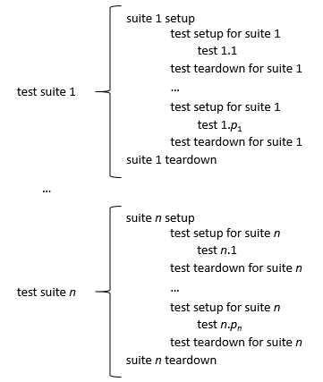

# Unit testing best practices

Very often code defects are introduced while the code evolves to implement new features or even to fix emerging problems.  Without proper testing these new bugs may go unnoticed for a while, even until after the release of a new version of a software project.

Hence it is good practice to have a set of tests at hand for regression testing, i.e., testing whether what used to work correctly, still does.  It is a very important aspect of a software project with a non-trivial life-cycle.

Testing code by running an application and visually inspecting the results is very error-prone. It is all too easy  to miss a problem when the output is fairly long, as would be the case for most software projects.  Hence a different approach should be taken.

Another consideration when planning tests is that they should be easy to run and should complete in a reasonably short time.  Such tests offer no excuses to delay running them or to not run them frequently. If those tests can be part of the software build process, and hence automated, that is an additional benefit.

From the output of a test failure, it should be very clear what the issue is. If we have tests that check a single concern, or a single use case, this will help to pinpoint the failure's causes much more easily.

Fortunately, all these criteria are met by the unit testing paradigm, popularised by the extreme programming developed by Kent Beck and Ron Jeffries around 1998.

Quoting from "The art of unit testing", Kent Beck defines a unit test as
> A unit test is an automated piece of code that invokes a unit of work in the system and then checks a single assumption about the behaviour of that unit of work.

Many implementations of unit testing frameworks exist, often multiple for the same programming language. They provide a framework that takes care of the scaffolding, i.e., the main function, to run the test, the formatting of the tests output and messages, and summary reporting.

As a programmer, you simply implement functions that test for specific features of your software, usually at the level of individual functions.  The framework provides functions to

  * compare expected to computed values,
  * the result of Boolean expressions,
  * whether exceptions have been thrown (if expected), and so on.

Once the test code is written, building and running it is very easy, and can be added as a target to a make file.

## What to test?

You will typically write unit tests that compare the return value of a function to an expected value. Good tests not only check for normal cases, but also for _edge or corner_ cases.  By way of example, consider the factorial function.  One would of course write tests to verify that its return value for 3 is 6, or for 5 is 120, but the cases where it is easy to make mistakes should also be tested, in this example the input values 0 and 1 (edge cases).

If the code under tests has branches, i.e., conditional statements, we should make sure that there is at least one test for each branch. The same applies to iteration statements when the number of iterations is computed, there should be tests in case no iterations have to be executed, a single iteration or multiple iterations.

Another important aspect to test for is whether a function throws an exception or generates an error when it is supposed to, since this is the function's declared behaviour.  For the factorial example, we should verify that an error occurs when you pass to it a strictly negative argument value.

Apart from providing some confidence that changes don't break our software, writing tests alongside code will actually prevent bugs, since you should really think about the behaviour of your code when writing tests. It is quite probable that while doing so, you will catch bugs without even executing the unit tests.

This idea is taken to the extreme in Test Driven Development (TDD).  A requirement is translated into a number of tests, and only when these are implemented, the actual functions are developed.  This approach is kind of satisfying: at first all tests fail, since there is a trivial implementation only.  As the development progresses, and the implementation gradually nears completion, more and more tests succeed.

## How to test?

Note that unit tests should be simple, i.e., a unit test check one particular aspect, so that failure is easy to map to its cause.  This means that functions implementing unit tests are typically very short, but that we may have quite many of them.

Another very important issue to keep in mind is that tests should be independent. You should be able to run them in any order without altering the results. This implies that unit tests have to be free of side effects.

To summarise the characteristics of a good unit test:

  * it is specific: failure of a test localises a defect in a small fragment of code;
  * it is orthogonal to other unit tests: unit tests should be independent of one another.

The collection of all tests for your software project should be complete.  There should be tests for all functions, but also for all code paths through your code.  An aspect that is often forgotten is that you should also test for expected failure.  Is an exception actually thrown, or does the exit status of a function reflect a problem?

When implementing a new feature or making a change, you should of course develop tests specific to that addition or modification.  However, it is not enough to simply run those new tests.  Even if they fail, your code might still be broken, since an addition or a modification might introduce a bug for existing code.  This situation is called a regression, since the code was correct, but due to changes, it no longer is.  Hence it is important to run all tests, to ensure that there are no regressions.  This practice is referred to as regression testing.  If unit testing is done well, regression testing is always performed.

Of course, many tests require a context to run in. Variables and data structures must have been initialised, a file should be present, and so on. Unit testing frameworks provide setup and teardown functions that can be run before and after each individual test respectively to set, or clean up the stage.  These temporary artefacts are often referred to as fixtures.

Unit testing frameworks typically also provide the means to group tests into so called suites, and run setup and teardown functions before running the first and after running the last test of that suite.  Units tests for large projects are typically organised into multiple suites that deal with specific subsets of the code or functionality.

Below you can see when various setup and teardown functions are called when test suites are executed.

We will discuss a unit testing framework for [Fortran](http://pfunit.sourceforge.net/) and one for [C](http://cunit.sourceforge.net/), and show how they can be used.  As mentioned, many frameworks are available, but once you understand one, it is very easy to start using another since they all operate along similar principles.
